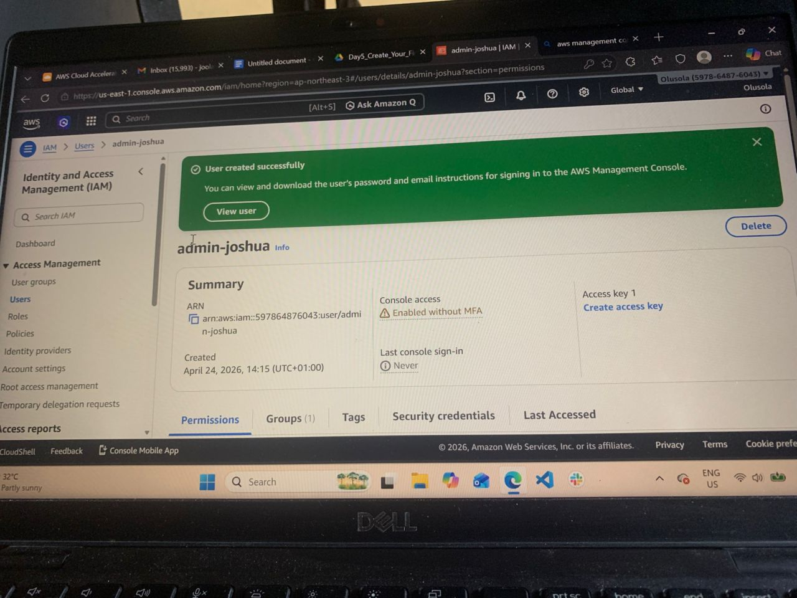

# IAM and account security setup

This lesson exposed key principles behind setting safeguards when starting an AWS account, I learnt about setting billing thresholds such as the billing alarm and the a budget using the cost based tools on AWS. IAM(Identity and access management ) serves a resource to enable or disable access to resources from different point of view. There are four IAM identities in AWS, they are:
Root: the account used to create an AWS account
User: a user account created for different account users
Groups: used to put users in a group, such as the developer group
Roles: temporary access granted to either services or users
IAM also uses policies, a policy is used to take a specific action, on a specific resource and the effect of those actions are explicitly specified as either allow or deny
In this lesson, it was emphasized that securing the root account with MFA is explicit for security purposes
I have create an IAM admin user with a dedicate MFA to ensure security of my root account, following the principle of least privilege from DAY 1, I also implemented threshold limits for my root account to apply to all accounts
