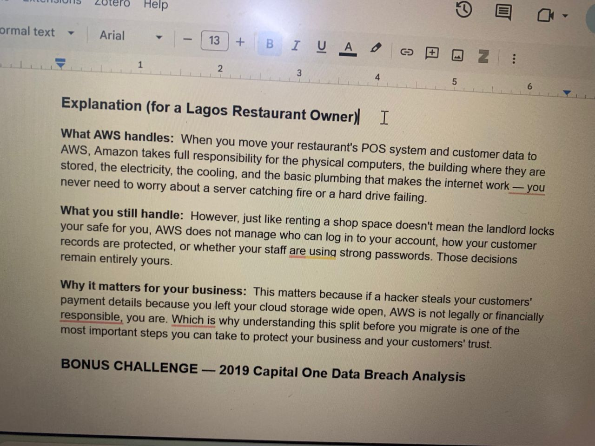
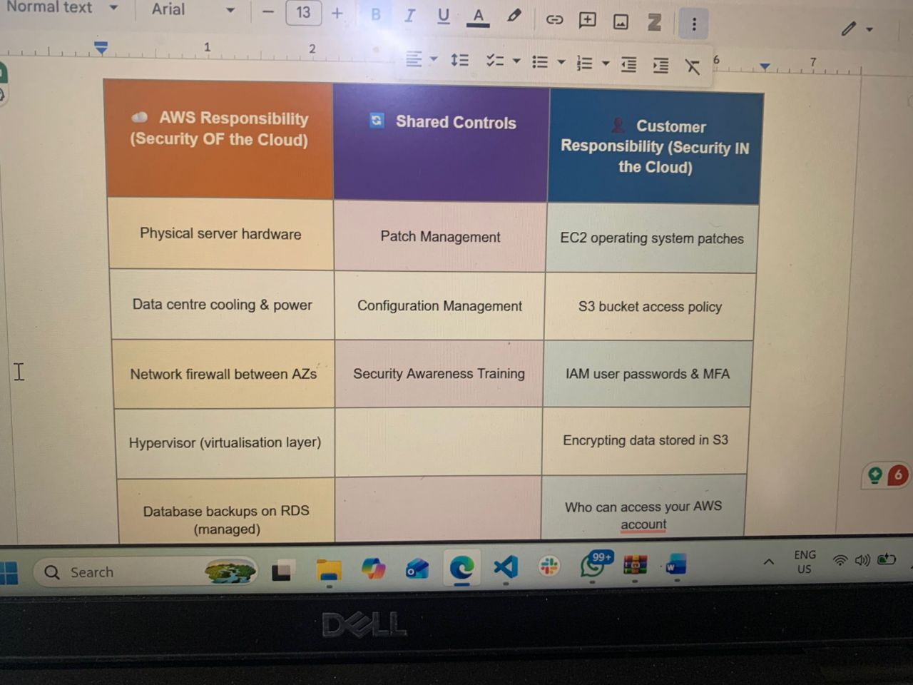
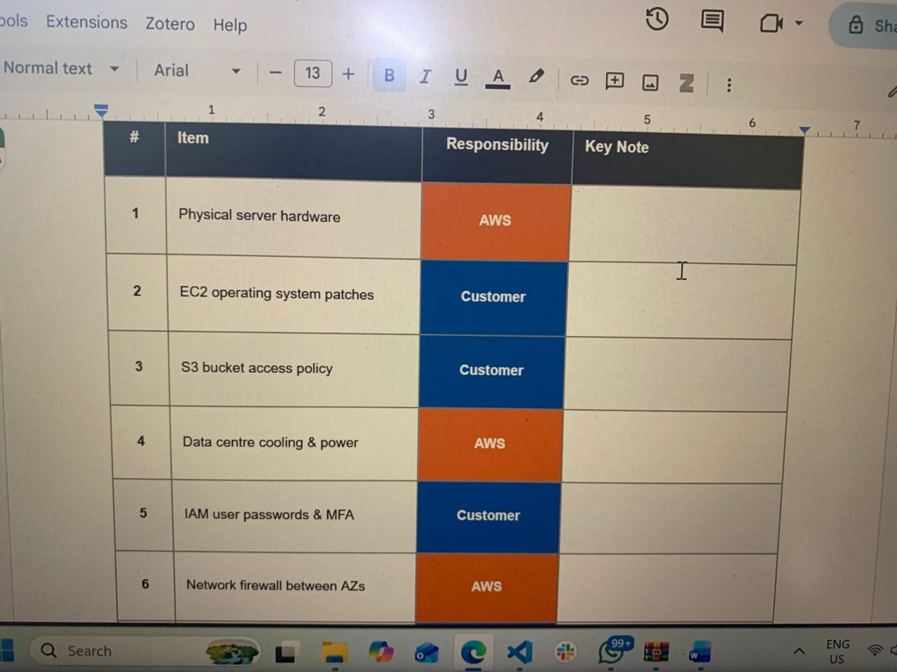

Day 3 exploring cloud concepts at Basestack Academy
Today’s AWS concept talks about the shared responsibility model where there’s a fine balance between what’s handled by the cloud provider which is AWS and what the customer handles. The shared responsibility model handles creates a split layer such that the customer is responsible for keeping sensitive data hidden from malicious individuals , keeping the code secure, updating application dependencies to avoid malicious intent. AWS is responsible for the managing the hardware and virtualization layer of the cloud, they are also responsible for the security in the data center environment that power the cloud. The task given was to create a table showing the responsibility of each party that participates in cloud computing, and how it affects both, I also was tasked to create a table that shows different aspects with checklists on who is responsible for what on the cloud. A given scenario is also stated about a restaurant owner and their role in the security in the cloud, how it affects their business and what AWS’s role in the security OF the cloud

