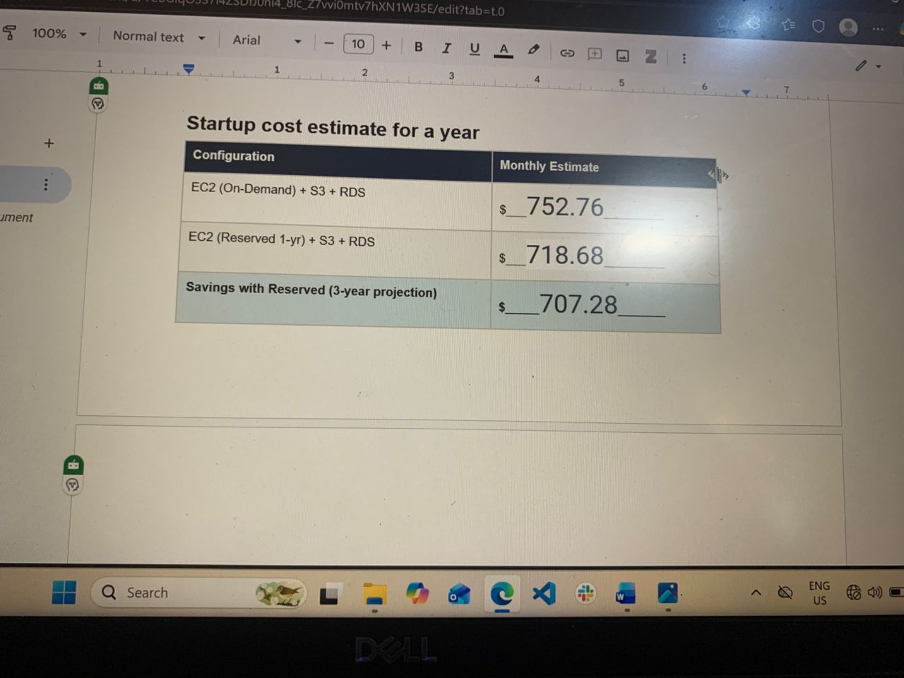
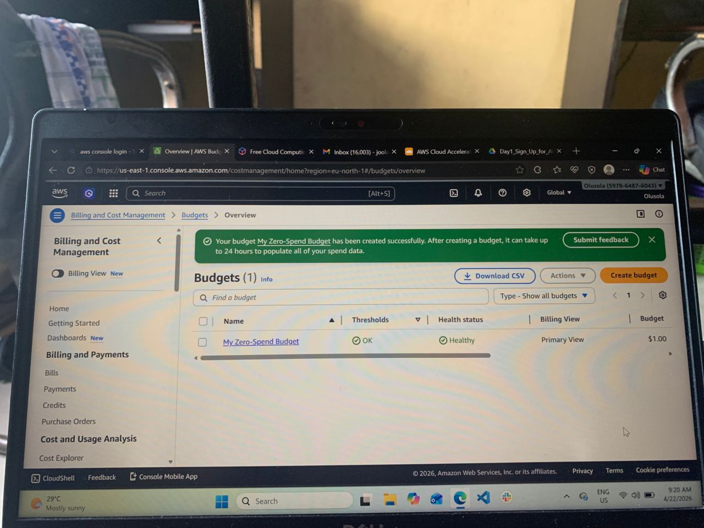

# Cloud Economics

Today we explored the concept of economics and finance in the cloud, using the cloud has proven to have intense financial savings compared to traditional IT environments. While traditional data centers operate using CAPEX(Capital expenses), using the cloud accounts for operational expenses, OPEX, paying for what is used on the cloud. The pricing model include:

- On-demand pricing, no up-front commitment, pay as you go pricing model
- Reserved instances(A user can have a bargain with AWS to pay upfront for 1-3 years worth of compute resources with a 72% discount)
- Spot instances, these are instances that have up to 90% discount as they are unused capacity of AWS but are interruptible
- Savings, offer up to 66% discount on compute capacity if the user commits to a particular spending limit
- Free-tier for experimenting and for learning
  I just set up AWS cost controls such as a zero-budget alert, a free-tier tracker an estimate for a pricing calculator, and a comparison between the on demand and reserved instance was shocking #AWSCLOUDARCHITECT #CLOUDECONOMICS #BASESTACKACADEMY
  
  
