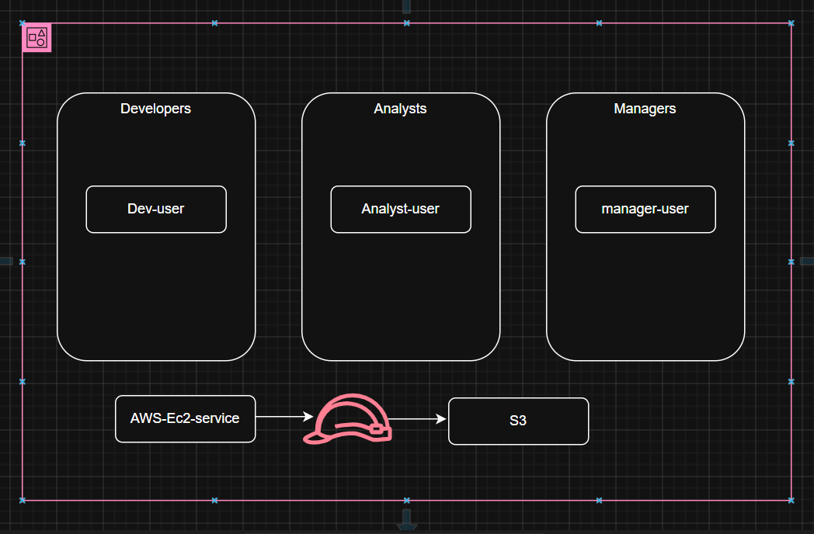
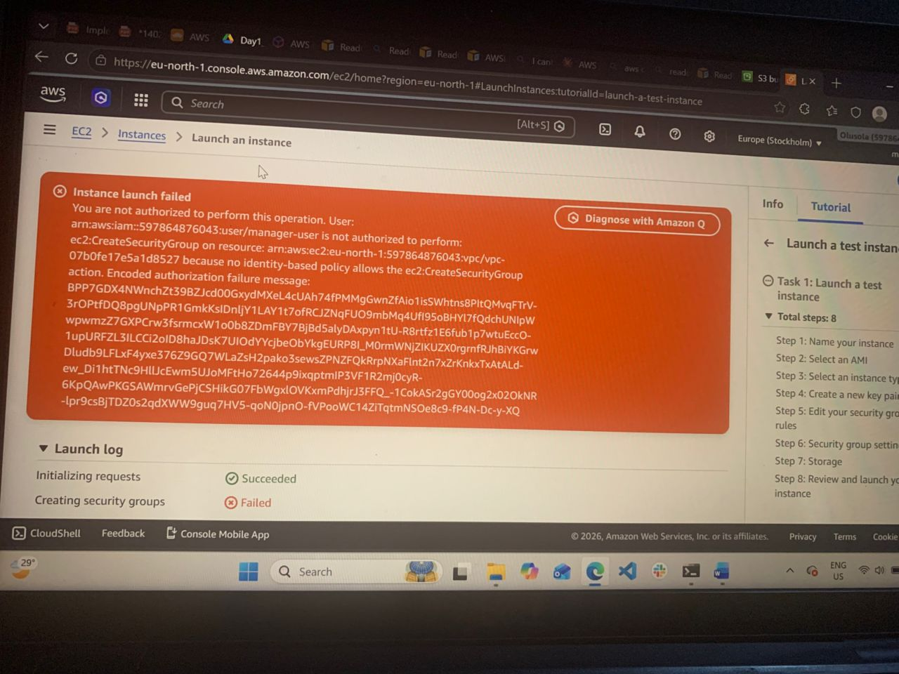
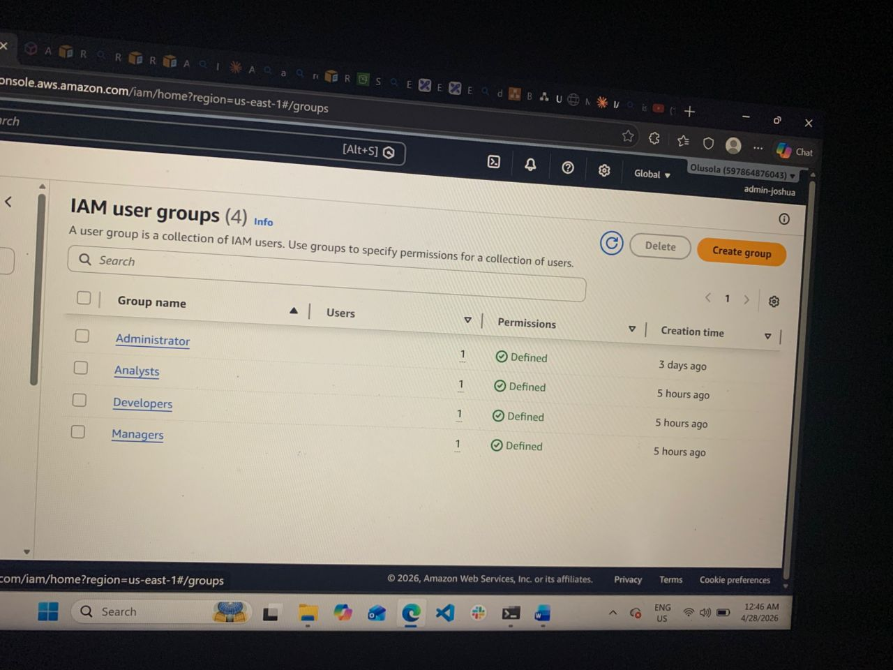
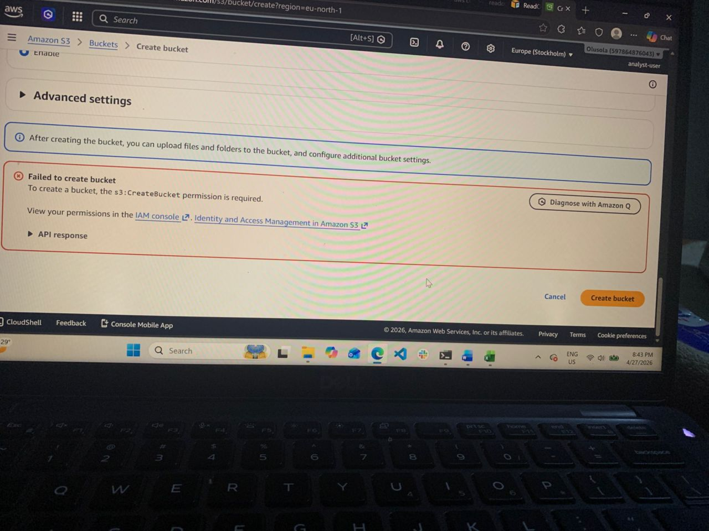

# IAM Security

Built a three-tier user structure with least-privilege permissions. This shows how real teams are setup. Today’s lesson broke down how to setup users groups and role access for different parts of a company. I’ve learn how a policy creates an allow/deny rule for AWS accounts. #IAM #AWSSECURITY #cloudarchitecture

  
