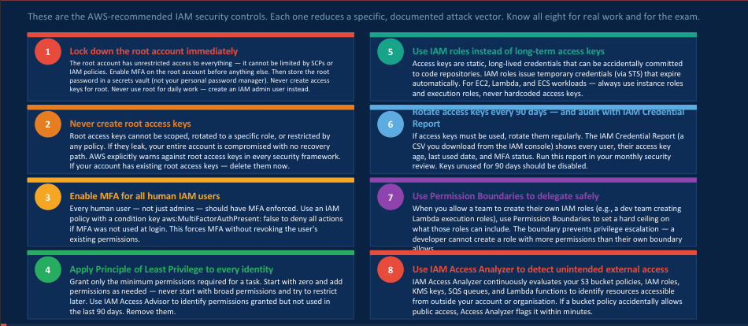

# Cloud Security and Multi-factor authentication

In the cloud, its better to have multiple layer of security that protect the identity of the users or the customers using the cloud in order to not compromise the security of the business or application user information. Today's lesson exposed me to different MFA devices that can be created, MFA devices can be grouped into virtual, hardware and public-private key pairs.
In the cloud, there are certain steps that are crucial in identity protection they are:

The root account in the AWS cloud should NEVER be used for day to day operation as this could compromise the entire AWS account and potentially expose key user information. Using policies MFA can be enforced on a user entity in order to add an additional layer of security.
In todays lab I correctly enforced MFA on my analyst group, in enforcing this policy I initially made a mistake of not adding an allow effect on some actions that would enable me to create a virtualMFA but corrected it later on because an implicit deny will automatically cause an not allow in any subtle manner. #AWS SECURITY #AWS CLOUD GOVERNANCE

.jpeg>)

