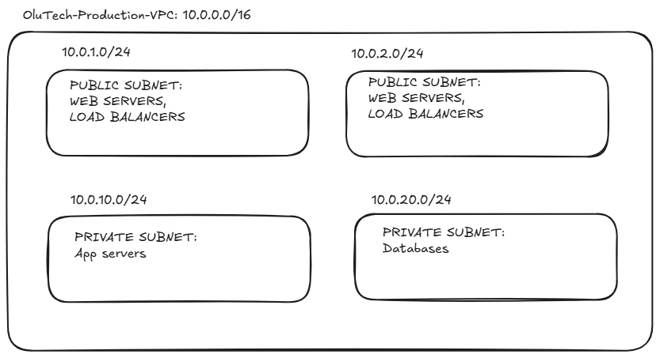

# AWS Network Infrastructure

Vpc are a logical isolation of the AWS cloud and it stands for Virtual private cloud. It is the a fundamental piece in architecting in the cloud environment and its quite crucial to understand the pieces such as a subnet which serves as a network environment that hosts the applications. A subnet could be private meaning that the internet cannot access the resources inside of the subnet although a private subnet can be access the internet using a network adress translator (NAT) gateway which allows for certain outbound traffic but never allows for inbound traffic, or it could be public which means that it could be. A VPC has a CIDR(Class Inter-Domain Routing) block that can be used to issue IP address for a number of devices such as 10.0.0.0/16, this CIDR block allows about 65,536 devices in that Virtual space. In other to allow the internet to access the resources inside a VPC, it needs to be connected to an Internet Gateway which has specific routing rules. A subnet is associated with at least one route table that defines a target and a destination. The target is where the traffic is headed such as Internet Gateway and the destination is the Subnet CIDR block. Cloud security groups which are compute instance focused are stateful network devices that allow traffic from outside sources. It doesn't have a deny rule for compute instances which means that if there isn't an explicit allow rule then that traffic is denied automatically. Security groups evaluate based on permission. Network Access Control lists are stateless which are associated with subnet. It needs to specifically define inbound and outbound traffic rules. NACL evaluate traffic based on numerical order of the rules.
For every subnet AWS reserves 5 IPS which are the network(.0), vpc router(.1), DNS(.2), future use(.3) and broadcast(.255)
I created a network architecture and implemented it in the cloud environment using a CIDR block, a private a subnet and a public subnet. This is the core of architecting in the AWS cloud, #VPC #AWSNETWORKARCHITECTURE #CLOUDARCHITECTURE

