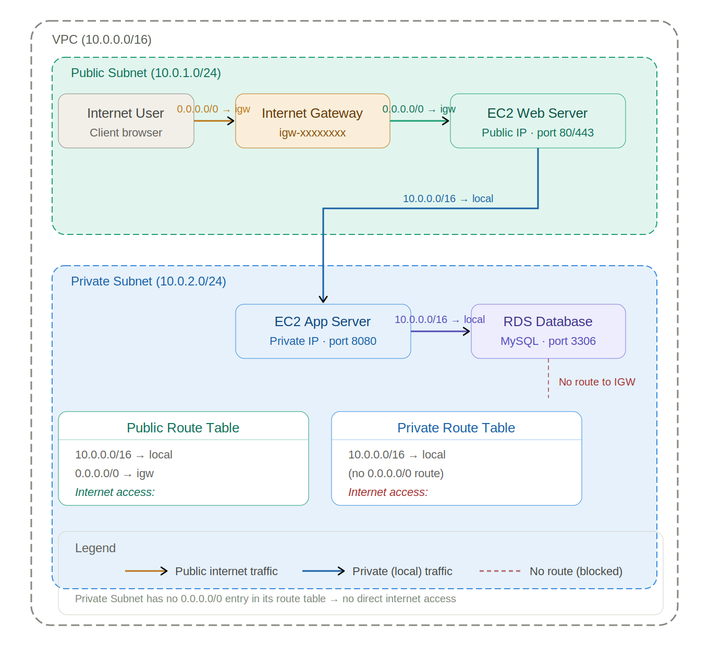

# Subnets

A subnet could be private meaning that the internet cannot access the resources inside of the subnet although a private subnet can be access the internet using a network adress translator (NAT) gateway which allows for certain outbound traffic but never allows for inbound traffic, or it could be public which means that it could be.
In other to allow the internet to access the resources inside a VPC, it needs to be connected to an Internet Gateway which has specific routing rules. A subnet is associated with at least one route table that defines a target and a destination. The target is where the traffic is headed such as Internet Gateway and the destination is the Subnet CIDR block
Deep-dived into VPC routing today. The single most important thing I learned: a
subnet is only PUBLIC if its route table has a 0.0.0.0/0 route pointing to an Internet Gateway.
The name means nothing — the routes do. Traffic flow diagram attached. #VPC #Networking
#AWSarchitecture'

